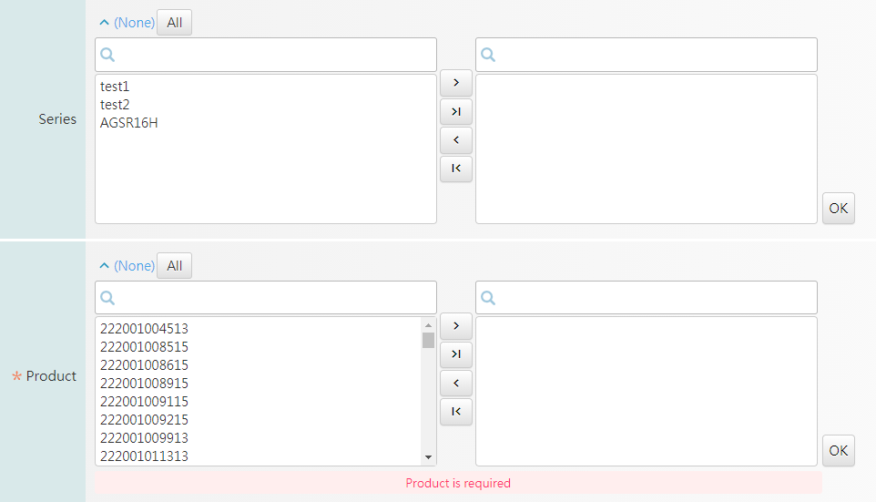

# example2 : UI 選項available 前一選項為非必選時, 要呈現全部選項

當Criterial 前一選項\(Series\)為非必選時,需要呈現所有選項\(Product\)



附上SQL

```text
<query_sql use_connection_id="edadbt">select distinct(a.product_id) 
from cmn_pf_fab_product_t a, cmn_pf_product_t b
where a.fab_id in (#c1.result#) and a.category in (select distinct (category) from cmn_pf_step_t where fab_id in (#c1.result#) and step_id in (#c2.result#)) and ( 1= (case when (select count(*) from cmn_pf_product_t where item4 in (#c7.result#)) = 0 then 1 else 0 end ) or  b.item4 in ( #c7.result# )) and a.product_id = b.product_id order by a.product_id</query_sql>
```

