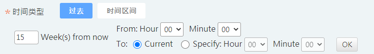

# view\_type="date"

```markup
<criteria id="c_date_option.past_day" view_type="date" is_required="true" label="Past Days" 
			result_args="past_days,past_days_start_hh,past_days_start_mm"  next_criteria="step_id_list" >
	<date_opt date_type="past_days" default_value="1" />
	<past_days_opt start_time="00:00"  />			
</criteria>
```

```markup
<criteria id="past_day" view_type="date" is_required="true" pre_criteria="date_type=past_day" next_criteria="">
     <date_opt date_type="past_days" past_mode="past_weeks" default_value="1"></date_opt>
     <past_days_opt start_time="07:30" end_time="00:00"></past_days_opt>
</criteria>
```



### date\_opt

| Attributes | Required | Parameters | Description |
| :--- | :--- | :--- | :--- |
| date\_type | V | past\_days / date\_range / past\_hours / date\_range\_DTN/date\_range\_WTD/ date\_range\_MTD/week/month | 判斷 user 所選的 date\_type為何 |
| show\_hhmm |  | true/false | 預設false, 當date\_type='week' or 'month', 控制是否要讓user設定時分 |
| default\_value |  |  |  |
| start\_time |  |  |  |
| end\_time |  |  |  |
| start\_date |  |  | DTN start\_date 一定是 today ;          WTD  start\_date  : monday \|\| tuesday \|\| wednesday;                                            MTD  start\_date : 1\_of\_month  \|\| 2\_of\_month ...... |
| start\_hhmm |  |  |  |
| end\_date |  |  | DTN end\_date一定是today |
| end\_hhmm |  |  |  |
| max\_count |  |  | 選取天數的最大值 \(單位 : 天\) |
| date\_column\_name\_list |  |  | 需要處理的欄位 |
| date\_src\_mode |  |  | 處理日期模式 |
| is\_support\_source\_data\_set |  | true / false | 預設false , 只有在ET Mode 能使用 |
| past\_mode |  | past\_days/past\_weeks/past\_months | 當data\_type="past\_days",且past\_days\_opt有設定end\_time,此設定選項才得以使用。預設past\_days,此設定再於決定要使用過去by day、week、month方式,且end\_time選取方式會出現radio切換current或specify |

### past\_days\_opt 

| Attributes | Required | Parameters | Description |
| :--- | :--- | :--- | :--- |
| start\_time |  |  |  |
| end\_time |  |  |  |

