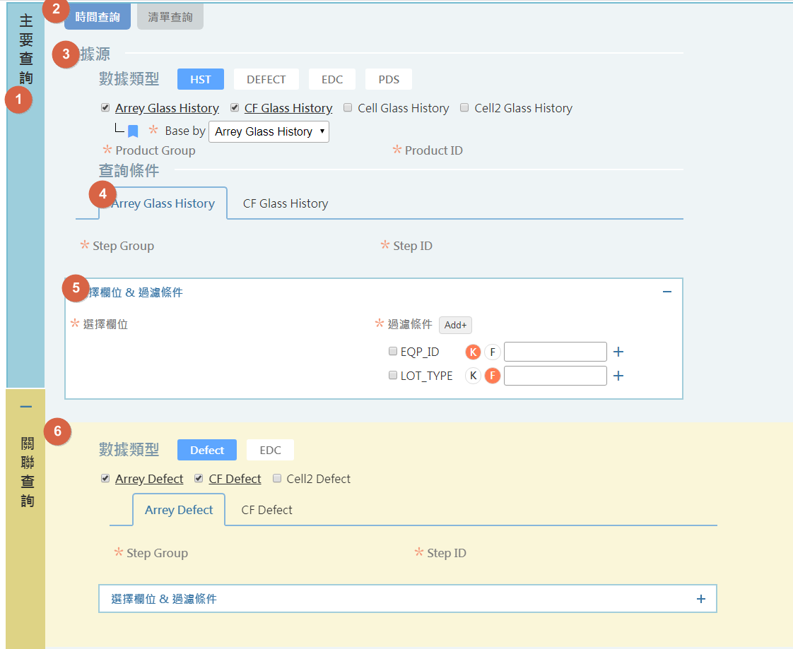

# view\_type="ui\_group"


可參考網頁 : [https://docs.google.com/presentation/d/1avgsiVl8tDc26ke4GgRNxdhjqnx2fxit5gF4XN1fkQ8/edit?ts=5e746972\#slide=id.g81ae0911fa\_0\_8](https://docs.google.com/presentation/d/1avgsiVl8tDc26ke4GgRNxdhjqnx2fxit5gF4XN1fkQ8/edit?ts=5e746972#slide=id.g81ae0911fa_0_8)


### Criteria

| Attributes | Required | Parameters | Description | Support css |
| :--- | :--- | :--- | :--- | :--- |
| ui\_group\_style | V | **mainContent**/**mainTabs**/3/**tab-group/accordion** | 決定使用何種樣式 |  |
| ui\_color |  |  | 定義group背景顏色 | **mainContent** |
| ui\_group\_type |  | expand\_or\_collapse | 決定group是否能夠縮合 | **mainContent**/**accordion** |
| ui\_group\_default\_expand |  |  | ui\_group\_type="expand\_or\_collapse" , 設定縮合的初始狀態, 預設值true | **mainContent**/**accordion** |

### tab\_opt


ui\_group\_style="4"的時候才需要被定義


| Attributes | Required | Parameters | Description |
| :--- | :--- | :--- | :--- |
| id |  |  |  |
| label |  |  | tab上顯示的名稱 |

