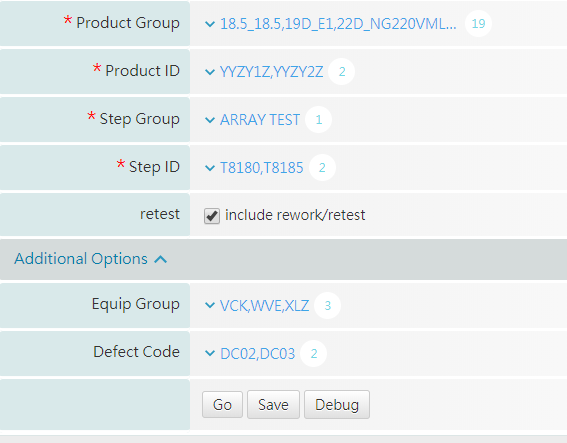

# expand\_or\_collapse

```markup
<criteria id="c_optional_group" view_type="criteria_group" ui_type="expand_or_collapse" is_required="false" label="Additional Options"   default_expand="true" >
    <sub_criteria_list>
        <sub_criteria key="c_equip_group_list"/>
        <sub_criteria key="c_defect_code_list"/>
    </sub_criteria_list>
</criteria>

<criteria id="c_equip_group_list"  view_type="select" label="Equip Group"   result_args="equip_group">
       <select_opt view_type="multiple" avail_from="constants" />
       <avail_constants>TEST,VCK,WVE,XLZ</avail_constants>     
</criteria>      

<criteria id="c_defect_code_list"  view_type="select" label="Defect Code"   result_args="defect_code_list"   >
   <select_opt view_type="multiple" avail_from="constants" />
    <avail_constants>DC01,DC02,DC03</avail_constants>     
</criteria>        
```



