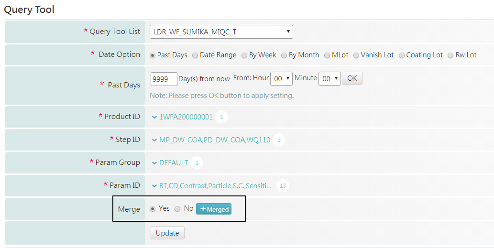
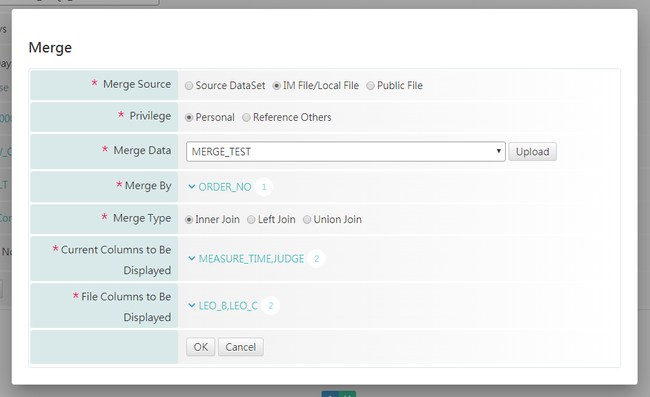

# merge\_column\_picker

```markup
<criteria id="merge"  view_type="merge_column_picker" is_required="false" label="Merge" result_args="merge">
    <opt id="merge.mergeSource" pre_select="im_file_local_file"></opt>
    <opt id="merge.mergeType"   pre_select="left_join"></opt>
</criteria>
```

目前有使用到sourceDataSet , 在global\_args\_define**必須**新增 

```markup
<arg name="merge.source_data_set_id"   from_id="merge"          data_type="string" />
<arg name="merge.column_name" 		   from_id="merge"         data_type="string"  />
<arg name="merge.distinct_data_list"   from_id="merge"          data_type="string_array"  />
```





## argmaps 存放範例

```text
{name: "merge.source_data_set_id", data_type: "string", from_id: "merge"}
{name: "merge.column_name", data_type: "string", from_id: "merge"}
{name: "merge.distinct_data_list", data_type: "string_array", from_id: "merge"}
{name: "merge", data_type: "string_array", data_value: "yes", from_id: "merge"}
{name: "merge.mergeSource", data_type: "string_array", data_value: "im_file_local_file", from_id: "merge.mergeSource"}
{name: "merge.mergeData", data_type: "string_array", data_value: "4996", from_id: "merge.mergeData"}
{name: "merge.mergeType", data_type: "string_array", data_value: "inner_join", from_id: "merge.mergeType"}
{name: "merge.merge_by", data_type: "string_array", data_value: "WF_SUMIKA_MIQC_HEAD_T.ORDER_NO", from_id: "merge.merge_by"}
{name: "merge.merge_by_display_name", data_type: "string_array", data_value: "ORDER_NO", from_id: "merge.merge_by_display_name"}
{name: "merge.merge_by.param_name_list_all", data_type: "string_array", from_id: "merge.merge_by.param_name_list_all"}
{name: "merge.current_column", data_type: "string_array", data_value: "WF_SUMIKA_MIQC_HEAD_T.MEASURE_TIME,WF_SUMIKA_MIQC_RESULT_T.JUDGE", from_id: "merge.current_column"}
{name: "merge.current_column_display_name", data_type: "string_array", data_value: "MEASURE_TIME,JUDGE", from_id: "merge.current_column_display_name"}
{name: "merge.current_column.param_name_list_all", data_type: "string_array", from_id: "merge.current_column.param_name_list_all"}
{name: "merge.file_column", data_type: "string_array", data_value: "LEO_B,LEO_C", from_id: "merge.file_column"}
{name: "merge.file_column_display_name", data_type: "string_array", data_value: "LEO_B,LEO_C", from_id: "merge.file_column_display_name"}
{name: "merge.file_column.param_name_list_all", data_type: "string_array", from_id: "merge.file_column.param_name_list_all"}
{name: "merge.privilege", data_type: "string_array", data_value: "personal", from_id: "merge.privilege"}
{name: "merge.department", data_type: "string_array", from_id: "merge.department"}
{name: "merge.owner", data_type: "string_array", from_id: "merge.owner"}
{name: "merge.imfile", data_type: "string_array", data_value: "4996", from_id: "merge.imfile"}
{name: "merge.column", data_type: "string_array", from_id: "merge.column"}
```

