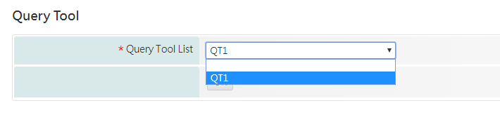

# ADD QT to AP

## 基本設定

```sql
insert into tyne_config_t values ('QT.XML_FROM','FILE');  
insert into tyne_config_t values ('QT.XML_DIR','Server_File/QT');  
insert into tyne_config_t values ('QT.IS_CACHE_XML','F');
```

## 新增至MENU

```sql
insert into tyne_menu_t ( menu_name ,parent_menu_index,display_seq) values ('QT',0,1);
insert into  tyne_analysis_t values ('QT1','QQQQQQQQQQQQQQT1','QQQQQQQQQQQQQQT1','QT',null);
insert into tyne_menu_t (menu_name, parent_menu_index, display_seq, web_ui_cmd, analysis_id)
    select 'QQQQQQQQQQQQQQT1',
       	to_number((select menu_index from tyne_menu_t where parent_menu_index = 0 and menu_name = 'QT')) ver,
           5,
           '/edatool/query_tool/ds_main.do?analysis_id=QT1&query_ds_id=QT1',
           'QT1'
    from dual;
insert into edatool_query_tool_plugin_t (QUERY_TOOL_ID, DISPLAY_NAME, CRITERIA_XML, UPDATE_TIME, DISPLAY_SEQ, PLUGIN_DB_ID, QUERY_TOOL_TYPE, STATUS, COMMENTS)
values ('QT1', 'QT1', '', to_date('03-07-2019', 'dd-mm-yyyy'), 1, '1', 'DS_FUNCTION', '', '');
```

## 開啟ET\_QT

```sql
//開啟Query Tool按鈕
insert into edatool_tool_t (CATEGORY_ID, TOOL_ID, DISPLAY_NAME, DISPLAY_SEQ, WEB_UI_CMD, ICON_PATHNAME_REL)
values ('DATASET_TOOL', 'DS_QUERY_TOOL', 'Query Tool', 8, '/edatool/query_tool/main.do', '/edatool3/images/ET_Query_tool.svg');

//新增選取值
insert into edatool_query_tool_plugin_t (QUERY_TOOL_ID, DISPLAY_NAME, CRITERIA_XML, UPDATE_TIME, DISPLAY_SEQ, PLUGIN_DB_ID, QUERY_TOOL_TYPE)
values ('ET_QT1', 'QT1', '', to_date('10-10-2017', 'dd-mm-yyyy'), 3, '1', 'ET_QUERY_TOOL');
```





