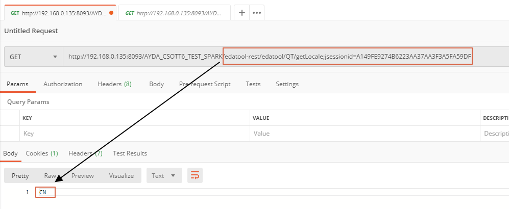

# QT2.0 : i18n support

1. 給User定義i18n property
2. 放置路徑  \(tomcat\_home/Server\_File\)
3. 語系來源 : 後端從EDA取得目前語系 \(共用EDA的方法\) , 讓前端得知語系
   1. 目前從tyne\_all\_user設定個別User的語系
   2. 從 session.getAttribute\(Globals.LOCALE\_KEY\) 取得
4. Naming Rule :  太引提供建議範本 , 但不強制規定要如何命名
5. 前端如何取得Propery ?  直接到Server上面拿


如果啟動i18n, 代表所有Label都會去找Property裡面相對應的值

* 如果找不到, 請顯示 \[property not found\]



如何啟動i18n功能 ?

* 請參考 : [啟動i18n](criteria-tool-2.0/query-page.md)


