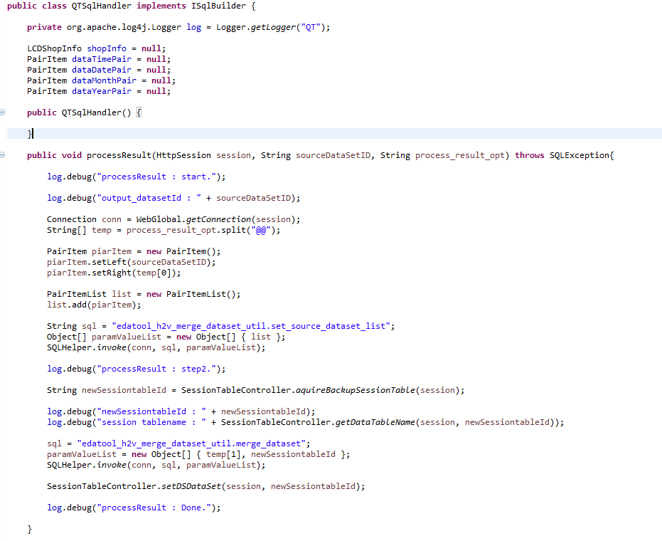

# example1 : Innotron 轉置功能

```markup
<query_sql use_connection_id="edadbt" process_result="true" process_result_opt="DS_DATA_PATH_SEL.DATA_PATH_METROLOGY_WAFER_SUMMARY_V@@LOT" class_name="com.tynesys.CXMT.qt.QTSqlHandler">
	<sql>
		select *
		from met_wafer_summary_t where 1=1 #criteria_replace_sql# order by met_wafer_summary_t.wafer_start_time
	</sql>
	<column_mapping>
		<column src_col_name="MET_WAFER_SUMMARY_T.STEP_ID" data_type="VARCHAR2" display_name="STEP_ID" />
		<column src_col_name="MET_WAFER_SUMMARY_T.PARAM_GROUP" data_type="VARCHAR2" display_name="PARAM_GROUP" />
		<column src_col_name="MET_WAFER_SUMMARY_T.PARAM_ID" data_type="VARCHAR2" display_name="PARAM_ID" />
		<column src_col_name="MET_WAFER_SUMMARY_T.WAFER_ID" data_type="VARCHAR2" display_name="WAFER_ID" />
		<column src_col_name="MET_WAFER_SUMMARY_T.WAFER_START_TIME" data_type="DATE" display_name="WAFER_START_TIME" />
		<column src_col_name="MET_WAFER_SUMMARY_T.PRODUCT_ID" data_type="VARCHAR2" display_name="PRODUCT_ID" />
		<column src_col_name="MET_WAFER_SUMMARY_T.LOT_ID" data_type="VARCHAR2" display_name="LOT_ID" />
		<column src_col_name="MET_WAFER_SUMMARY_T.NUMBER_ITEM1" data_type="NUMBER" display_name="NUMBER_ITEM1_DISPLAY" />
	</column_mapping>
</query_sql>
```

* 啟用功能 : process\_result="true"
* 傳遞參數 : process\_result\_opt="DS\_DATA\_PATH\_SEL.DATA\_PATH\_METROLOGY\_WAFER\_SUMMARY\_V@@LOT"
* 需要plugonclass特別處理Query完資料後的動作




