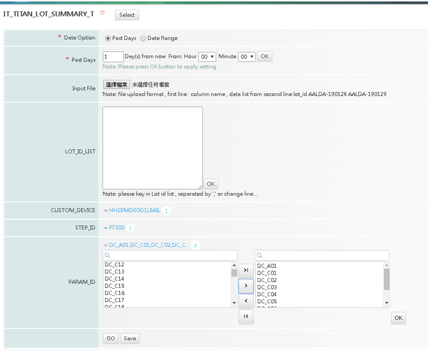

# Step1 : 設計QT頁面需要有哪些元件

以最後的畫面往回推的話 , 



我需要的元件對照到criteria分別為 :

### Date Option

```markup
<criteria id="c_date_opt" view_type="criteria_group" sel_type="radio" is_required="true" label="Date Option" result_args="date_option" next_criteria="#radio_result#">
            <sub_criteria_list>
                <sub_criteria key="c_date_option.past_day" radio_display_name="Past Days" />
                <sub_criteria key="c_date_option.date_range" radio_display_name="Date Range" />
            </sub_criteria_list>
        </criteria>
```

sub\_criteria\_list 表示需要包含兩種選擇 , 對應到畫面就是**Past Days , Date Range,** 只要使用到上述兩個criteria **,** 就必須在下面定義 

```markup
<criteria id="c_date_option.past_day" view_type="date" is_required="true" label="Past Days" result_args="past_days,past_days_start_hh,past_days_start_mm" next_criteria="custom_type_list">
    <date_opt date_type="past_days" default_value="1" />
    <past_days_opt start_time="00:00" />
</criteria>
<criteria id="c_date_option.date_range" view_type="date" is_required="true" label="Date Range" result_args="start_time,end_time" next_criteria="custom_type_list">
    <date_opt date_type="date_range" start_time="07:30" end_time="07:30" />
</criteria>
```

### Input File & Lot\_id\_list

目前Input File & Lot\_id\_list 同一個元件 ,  根據is\_support\_file\_upload 來決定是否開啟Input File的功能

```markup
<criteria id="lot_id_list" view_type="key_in" is_required="false" is_support_file_upload="true" label="LOT_ID_LIST" result_args="lot_id_list" next_criteria="custom_type_list">
    <keyin_opt row="10" width="300">
        <desc>please key in Lot id list , separated by ',' or change line.... </desc>
    </keyin_opt>
    <file_upload_opt is_skip_first="true">
        <support_file_type>.csv,.txt</support_file_type>
        <desc>file upload format  , first line : column name , data list from second line
					lot_id
					AALDA-190128	
					AALDA-190129	
				</desc>
    </file_upload_opt>
</criteria>
```

### 其餘元件

```markup
<criteria id="custom_type_list" view_type="select" is_required="false" label="CUSTOM_TYPE" result_args="custom_type_list" next_criteria="prod_id_list">
    <select_opt view_type="multiple" avail_from="avail_data_method" avail_data_method="get_avail_class4_list" />
</criteria>
<criteria id="prod_id_list" view_type="select" is_required="false" label="PRODUCT_ID" result_args="prod_id_list" pre_criteria="custom_type_list" next_criteria="custom_device_list">
    <select_opt view_type="multiple" avail_from="avail_data_method" avail_data_method="get_avail_class5_list" />
</criteria>
<criteria id="custom_device_list" view_type="select" is_required="false" label="CUSTOM_DEVICE" result_args="custom_device_list" pre_criteria="prod_id_list" next_criteria="step_id_list">
    <select_opt view_type="multiple" avail_from="avail_data_method" avail_data_method="get_avail_class1_list" />
</criteria>
<criteria id="step_id_list" view_type="select" is_required="false" label="STEP_ID" result_args="step_id_list" pre_criteria="custom_device_list" next_criteria="param_id_list">
    <select_opt view_type="multiple" avail_from="avail_data_method" avail_data_method="get_avail_class2_list" />
</criteria>
<criteria id="param_id_list" view_type="select" is_required="false" label="PARAM_ID" pre_criteria="step_id_list" result_args="param_id_list">
    <select_opt view_type="multiple" avail_from="avail_data_method" avail_data_method="get_avail_class3_list" />
</criteria>
```

