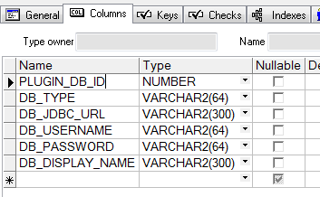

# Step2 : 元件資料來源

criteria 的值 , 來源可以分為兩種 

1. 固定
2. 動態

固定值需要先定義Criteria Attributes - avail\_from="constants" , 接著在avail\_constants 定義值

```markup
<criteria id="step_id_list"  view_type="select" is_required="false" label="Step ID"  result_args="step_id_list" 
		 avail_data_method.args="equip_group_list">
	<select_opt view_type="multiple" avail_from="constants" />
	<avail_constants>A41,A421,A501,A412S2,A424,A413S2,A413,A415,A71,A53,A710,A425,A111,A422,A119,A411S1,A411,A50,A417,A42,A701,A416,A66,A423,A414,A411S2,A414S2,A412,A51,A412S1,A413S4</avail_constants>			
</criteria>
```

動態值則是透過Criteria Attributes - avail\_from="avail\_data\_method" , 接著定義avail\_data\_method="get\_avail\_class3\_list"

```markup
<criteria id="param_id_list" view_type="select" is_required="false" label="PARAM_ID" pre_criteria="step_id_list" result_args="param_id_list">
      <select_opt view_type="multiple" avail_from="avail_data_method" avail_data_method="get_avail_class3_list" />
</criteria>
```

這時候就要對應到區塊\(avail\_data\_method\_list\)

```markup
<avail_data_method_list>
        <avail_data_method id="get_avail_class1_list" args="">
            <query_sql use_connection_id="mssql">SELECT distinct class3 FROM EEAS.dbo.menu_query_item_list where class1 in  (#custom_type_list#) and class2 in  (#prod_id_list#) and functionname='device_info' </query_sql>
        </avail_data_method>
        <avail_data_method id="get_avail_class2_list" args="">
            <query_sql use_connection_id="mssql">SELECT distinct class2 FROM EEAS.dbo.menu_query_item_list where class1 in (#custom_device_list#) and functionname='it_titan_lot_t'  </query_sql>
        </avail_data_method>
        <avail_data_method id="get_avail_class3_list">
            <query_sql use_connection_id="mssql">SELECT distinct class2 FROM EEAS.dbo.menu_query_item_list where class1 in  (#step_id_list#) and functionname='it_titan_lot_summary_t'  </query_sql>
        </avail_data_method>
        <avail_data_method id="get_avail_class4_list">
            <query_sql use_connection_id="mssql">SELECT distinct class1 FROM EEAS.dbo.menu_query_item_list where functionname='device_info'</query_sql>
        </avail_data_method>
        <avail_data_method id="get_avail_class5_list">
            <query_sql use_connection_id="mssql">SELECT distinct class2 FROM EEAS.dbo.menu_query_item_list where class1 in  (#custom_type_list#) and functionname='device_info'  </query_sql>
        </avail_data_method>
</avail_data_method_list>
```

在query\_sql  - use\_connection\_id 可以看到 mssql , 這時候就會對到區塊\(db\_connection\_config\)

```markup
<db_connection_config>
    <connection id="oracle" type="from_tyne_plugin_db_t" plugin_db_id="1" />
    <connection id="mssql" type="from_tyne_plugin_db_t" plugin_db_id="3" />
</db_connection_config>
```

type="from\_tyne\_plugin\_db\_t" , 會對應到oracle帳號下的**tyne\_plugin\_db\_t** , schema如下



plugin\_db\_id 會對應到schema相同的名稱

