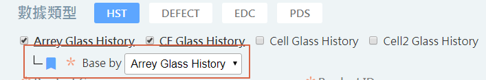

# S1-563

* URL規則遵照之前SPC drillDown的規則 : 

```text
http://192.168.0.113:8056/AYDA_CSOTT6_APT_KEN_TEST/logon.do?USER_ID=admin&username=admin&DIRECT_RUN_PREF=Y&direct_run_mode=REPLACE_DATA_WITH_COMPONENT&refer_analysis_id=ARRAY_TEST_PDA_BY_GLASS&COMPONENT_TYPE=ARRAY_GLASS&COMPONENT_ID_LIST=1,2,3&CONFIG_DATASEL_SELECTED=24828&target_shop=ARRAY
```

| Param | Value | Desc |
| :--- | :--- | :--- |
| USER\_ID |  | 帳號 |
| username |  | 密碼 |
| DIRECT\_RUN\_PREF | Y | 判斷是否用直接登入模式 |
| direct\_run\_mode | REPLACE\_DATA\_WITH\_COMPONENT | 走DrillDown模式 & others |
| refer\_analysis\_id |  | 指向function的名稱 |
| COMPONENT\_TYPE |  | 原SPC drilldown會使用 , QT drilldown不會 |
| COMPONENT\_ID\_LIST |  | 需要drilldown的Value |
| CONFIG\_DATASEL\_SELECTED |  |  |
| target\_shop |  | 原SPC drilldown會使用 , QT drilldown不會 |

* QT drillDown需要新增一個pluginclass :
  * 決定是否要開啟drilldown功能 :
    * **QT.DRILL\_DOWN\_DATA\_MAPPING\_CLASS\_NAME**  : 在TYNE\_CONFIG\_T加入pluginclass的路徑



* 最後就會將值帶到QT 需要替換的元件中  \( ex : 上圖的 ft\_lot\_id\_list \) , 後續就照舊 

