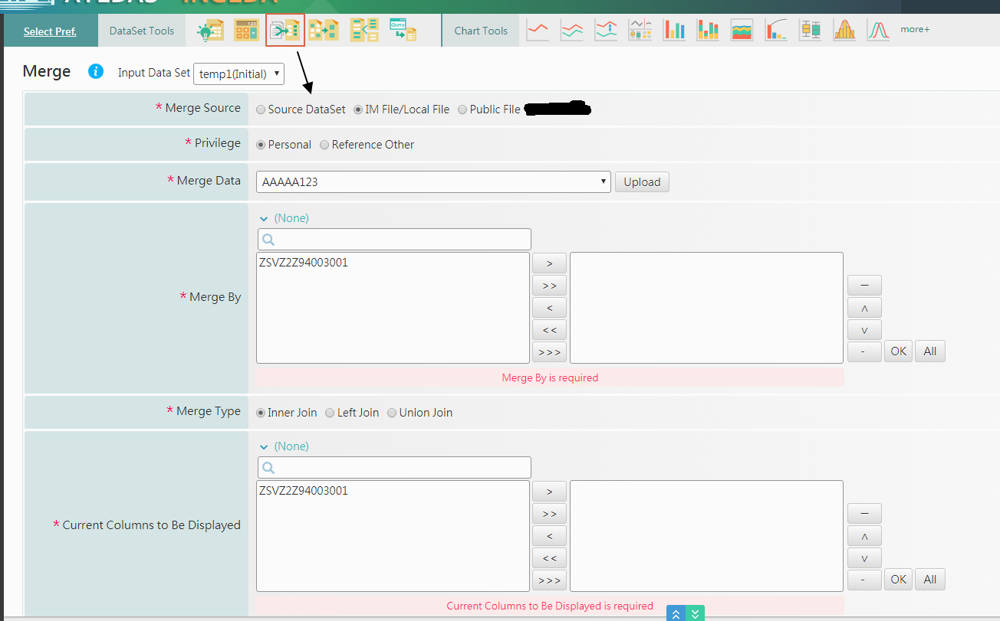

# S1-634

* 小ken 方面會新增一個元件 :

```markup
<criteria id="merge"  view_type="merge_column_picker" is_required="false" label="Merge" result_args="merge"></criteria>
```

* 條件如下 :
  * 畫面呈現Raido Button :  Yes /  No  , Yes後跳出lightbox
  * lightbox 的內容呈現, 遵照現有的畫面呈現\( 請參考EDA 畫面 \)
  * 後端程式使用Rest API , 需要重新Review目前Merge的程式碼 , 可共用的部分抽成共用
  * 執行完產生兩個 report dataset, 用檔名去區隔原始QT的那一組\(以方便以後追查問題\)



時間評估 :

* 編輯DOC   +   招開會議說明
* Review 現有程式  +   抽出可共用部分
* 開發Rest API Function  +  串接現有程式
* 新功能開發  :  **執行完產生兩個 report dataset, 用檔名去區隔原始QT的那一組**
* 測試
  * Rest API Function
  * 原有功能被修改成共用部分
* 完成後 , 回補Doc內容  \(需要描述的功能  +  UI呈現的畫面\)

